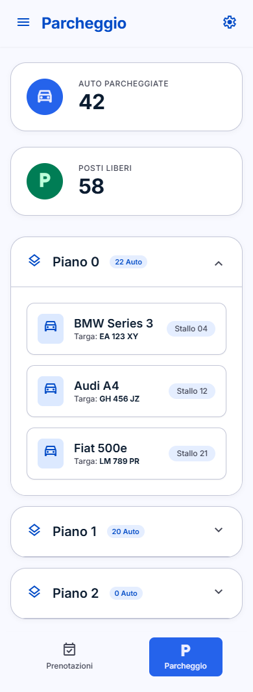
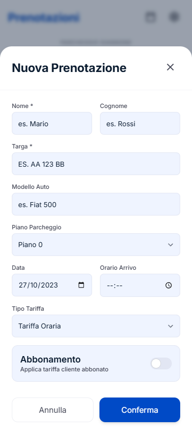
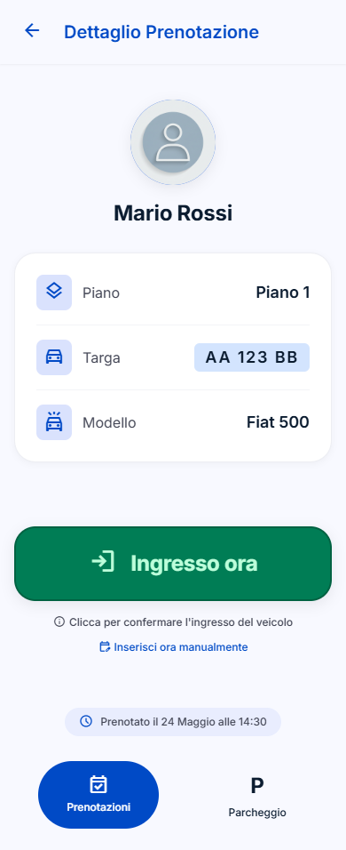

# 🚗 Parcheggio Giannone — Smart Parking Manager
<div align="center">
  <details open>
    <summary><b>Parcheggio Giannone</b></summary>
    <br />
    
    <br /><br />
  </details>
</div>

[](https://developer.android.com)
[](https://kotlinlang.org)
[](https://developer.android.com/jetpack/compose)
[](https://firebase.google.com)

> La soluzione definitiva, veloce ed elegante per la gestione in tempo reale del tuo parcheggio. Progettata appositamente per dispositivi mobili con un design premium ad alte prestazioni, transizioni fluide ed integrazione cloud istantanea.

---

## 🌟 Caratteristiche Principali

### 📅 1. Gestione Prenotazioni & Ricerca Rapida
Visualizza e organizza tutte le prenotazioni giorno per giorno. 
* **Navigazione Temporale Istantanea:** Cambia data rapidamente con le frecce direzionali debounced o usa il calendario pop-up integrato per saltare direttamente a un giorno specifico.
* **Filtro di Ricerca Intelligente:** Cerca all'istante inserendo il nome, il cognome o la targa dell'auto.
* **Transizioni Fluidissime:** Navigazione orizzontale reattiva con curve di accelerazione *EaseInOutCubic* e crossfade istantaneo per il passaggio tra i tab primari.

### 🏷️ 2. Tag di Stato Dinamici a Tre Vie
Tieni traccia dello stato di ciascuna vettura in tempo reale direttamente dall'elenco principale:
* <span style="color:#2196F3">**In arrivo**</span>: Auto prenotata che non ha ancora effettuato l'accesso.
* <span style="color:#4CAF50">**Parcheggiata**</span>: Vettura attualmente presente nel parcheggio ed occupante uno stallo.
* <span style="color:#9E9E9E">**Prenotazione chiusa**</span>: Soggiorno completato e pagamento registrato all'uscita.

### 📊 3. Stato del Parcheggio & Gestione Piani
Una panoramica in tempo reale della capacità del parcheggio:
* **Statistiche Istantanee:** Visualizza subito il totale delle auto parcheggiate e i posti liberi totali calcolati in base allo stato attuale.
* **Visualizzazione a Piani:** I piani (es. Piano 0, Piano 1) sono espandibili con un tocco. Mostrano il dettaglio delle auto parcheggiate in quel momento ed i posti liberi residui.

### 📈 4. Grafico degli Incassi Giornalieri
Tieni d'occhio le finanze della tua attività con stile:
* **Visualizzazione Trend:** Un grafico a barre personalizzato che mostra l'andamento degli incassi degli ultimi 7 giorni solari.
* **Feedback Visivo:** Barre colorate con brand color in base all'entità dell'incasso e cifre precise mostrate al click o sopra le barre positive, con label dei giorni aggiornate.

### 🧾 5. Calcolo Automatico Tariffe & Ricevute
Registra gli ingressi e le uscite con un solo tocco:
* **Orario Automatico o Manuale:** Puoi registrare gli eventi all'istante o digitare manualmente l'orario tramite il selettore dell'ora integrato.
* **Calcolo della Tariffa:** Calcola automaticamente le ore di sosta effettive (con arrotondamento all'ora successiva) e applica la tariffa specifica configurata per il cliente (Oraria, Giornaliera, Notturna, Eventi o Abbonato).
* **Resoconto Dettagliato:** Mostra orario d'ingresso, orario d'uscita, totale ore, tariffa utilizzata e totale pagato all'emissione dello scontrino digitale.

### 🛡️ 6. Inserimento Sicuro Targhe
* **Validazione Automatica:** Il campo Targa impedisce l'inserimento di spazi o caratteri speciali. Forza la scrittura in lettere maiuscole e limita l'input a **esattamente 7 caratteri alfanumerici**.
* **Prevenzione Errori:** Il tasto di conferma rimane disabilitato finché la targa non rispetta perfettamente il formato standard di 7 caratteri.

---

## 📸 Galleria Screenshot (UI Design)

Ecco come si presenta l'applicazione su dispositivo mobile:

| Stato Parcheggio & Grafici | Lista Prenotazioni | Nuova Prenotazione | Dettaglio e Stati |
| :---: | :---: | :---: | :---: |
|  |  |  |  |

---

## 🛠️ Stack Tecnologico & Architettura

L'applicazione è interamente sviluppata seguendo le linee guida moderne di Google per lo sviluppo Android nativo:
* **Kotlin (1.9+) & Jetpack Compose:** UI dichiarativa, reattiva e completamente personalizzata con stile Material Design 3.
* **Jetpack ViewModel & StateFlow:** Gestione pulita dello stato dell'interfaccia e programmazione asincrona tramite Coroutine.
* **Firebase Firestore (Cloud):** Database in tempo reale non-relazionale con sincronizzazione offline automatica. L'app continua a funzionare anche senza connessione e si allinea al cloud non appena torna online.
* **AndroidX Navigation 3:** Gestione della navigazione e delle rotte ad alte prestazioni con transizioni e animazioni personalizzate.

---

## 🚀 Come Compilare ed Avviare l'Applicazione

### Prerequisiti
* **Android Studio Ladybug (o superiore)** o SDK di Android configurato a riga di comando.
* Un dispositivo fisico Android collegato con debug USB attivo o un emulatore configurato.

### Istruzioni per la Compilazione
1. Clona questo repository sul tuo computer.
2. Assicurati che il file `google-services.json` del tuo progetto Firebase sia inserito nella cartella `app/app/`.
3. Apri il terminale nella cartella `app` ed esegui il comando per compilare l'APK:
   ```bash
   ./gradlew assembleDebug
   ```
4. Trova l'APK compilato pronto per essere distribuito o testato nel percorso:
   ```text
   app/build/outputs/apk/debug/app-debug.apk
   ```

### Installazione via riga di comando (ADB)
Con il telefono connesso e autorizzato tramite ADB, esegui:
```bash
adb install -r app/build/outputs/apk/debug/app-debug.apk
adb shell am start -n com.giannone.parcheggio/.MainActivity
```
